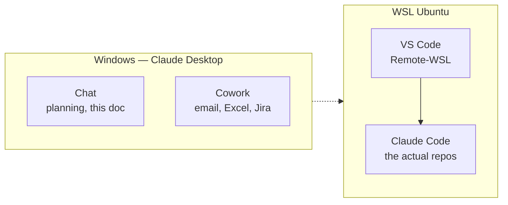
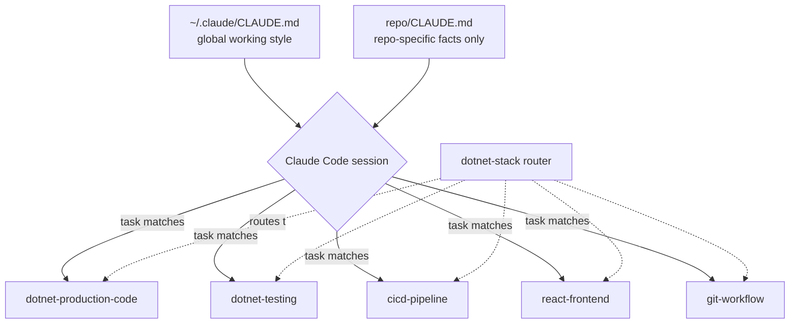
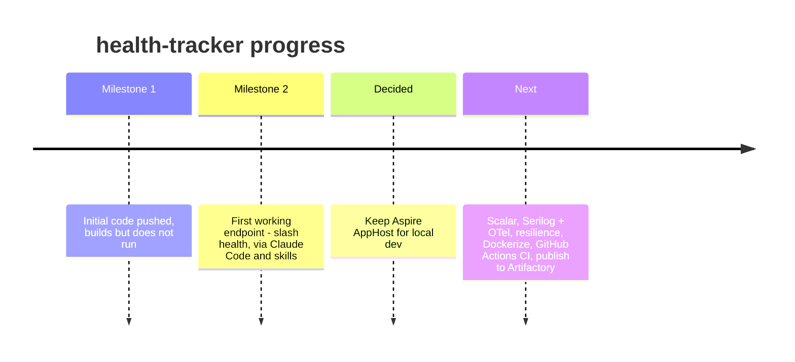

# Field Notes — Building an AI-Assisted .NET Workflow

*A working notebook, not a finished manual — updated as the setup actually gets used.*

Six weeks ago this was: Visual Studio on Windows, `dotnet run`, and Postman. Today it's WSL Ubuntu, VS Code, Claude Code reading six symlinked skills, and a real Docker-shaped local dev loop. This doc tracks how that happened, what broke along the way, and the reference material worth keeping.

**Stack:** .NET 10 / C# / React · **First project:** health-tracker · **Environment:** WSL Ubuntu + VS Code

---

## 1. The toolchain — who does what



- **Chat** — planning, questions, authoring skills/CLAUDE.md. Where this doc gets written.
- **Cowork** — everyday non-coding work: email triage, Excel, Jira story maintenance.
- **Claude Code** — lives inside WSL, works directly on the repos, reads the skills below.

Three tools, three jobs. The temptation is to blur them — don't; each one earns its place by staying in its lane.

---

## 2. Why WSL instead of Windows + Visual Studio

The old loop: build in Visual Studio, run locally, poke it with Postman — never once running as the container that actually ships. WSL closes that gap, because dev and prod finally speak the same filesystem.

| Old — Windows / Visual Studio | New — WSL Ubuntu / VS Code |
|---|---|
| Run via `dotnet run` / IIS Express, not a container | Same Linux filesystem the CI/CD pipeline builds from |
| Never touching the Linux toolchain the pipeline uses | Runs as an actual Docker image locally — same shape as prod |
| Manual Postman checks, no Docker parity | VS Code attaches via **Remote-WSL** — one real shell, no cross-filesystem lag |

> **Gotcha:** Opening a WSL folder via `\\wsl$\...` from Windows Explorer connects over a network share — slower, and can cause permission/line-ending issues. `sudo mkdir` for your own folders also leaves them `root`-owned, which fights git and VS Code later.
>
> **Fix:** `cd` into the repo from a WSL terminal, then `code .`. Recover a `root`-owned folder with `sudo chown -R $USER:$USER ~/.claude`.

---

## 3. CLAUDE.md vs. Skills — two memory mechanisms, not one

CLAUDE.md is **location-triggered**: it loads in full, based on where you are, whether it's relevant to the current task or not. A Skill is **task-triggered**: only its name + one-line description sit in context by default; the full body loads only when the task matches.



| | CLAUDE.md | Skills |
|---|---|---|
| Trigger | Location (global / repo / subfolder) | Task/description match |
| Shape | One flat file | Modular, one concern each |
| Best for | Working-style rules, repo-specific facts | Reusable conventions across every repo |

**Rule of thumb:** project `CLAUDE.md` points to the skills, never restates them. One convention, one home — the same discipline as not duplicating logic across two services.

---

## 4. The six skills

| Skill | Covers |
|---|---|
| **dotnet-stack** *(router)* | Routes to the right sub-skill(s); doesn't duplicate their content |
| **dotnet-production-code** | Minimal APIs + endpoint groups, exceptions → ProblemDetails, TimeProvider, Serilog + OTel, resilience retries |
| **dotnet-testing** | xUnit, test-first, Testcontainers over mocks, WebApplicationFactory over TestServer |
| **cicd-pipeline** | GitHub Actions stages, self-hosted Artifactory promotion, separate k8s-deploy repo, AKS + Key Vault |
| **react-frontend** | TypeScript, functional components only, query-lib server state, accessibility floor, Tailwind |
| **git-workflow** | Conventional Commits, no force-push to shared branches, no AI co-author |

### Wiring them in — the pattern that actually works

Symlinking the whole `~/.claude/skills` folder has open, unresolved discovery bugs upstream. Symlinking each **skill folder** individually, inside a real parent directory, is the version that holds up:

```bash
mkdir -p ~/.claude/skills
ln -s ~/repos/my-ai-skills/dotnet-stack ~/.claude/skills/dotnet-stack
ln -s ~/repos/my-ai-skills/dotnet-production-code ~/.claude/skills/dotnet-production-code
# ...repeat per skill, then verify:
claude
> /skills   # all six should show "On"
```

- ✅ Repo is the source of truth — edit there, the symlink reflects it instantly, no restart needed.
- ✅ Skill body edits are picked up live by a running Claude Code session.
- ❌ Don't symlink `~/.claude/skills` itself — known regression, skills silently fail to be discovered.
- ❌ Don't duplicate a convention in both a project CLAUDE.md and a skill — it drifts, guaranteed.

---

## 5. Reviewing a diff — no Beyond Compare needed

VS Code's Source Control panel gives the same side-by-side diff as Beyond Compare, GitHub Desktop, or Visual Studio's diff tool — natively, over the Remote-WSL connection.

```bash
git status   # confirm what changed
git diff     # quick inline read in the terminal
# — or —
# Ctrl+Shift+G → Source Control panel → click a file for a visual diff
```

---

## 6. health-tracker — applying it, as it happened



The Aspire decision is worth remembering *why*, not just *what*: Aspire's AppHost orchestrates local Postgres/Redis containers and doesn't compete with the production Dockerfile — they run in parallel. Its dashboard also happens to visualize the Serilog + OpenTelemetry data live, which is the actual payoff for a solo dev debugging alone.

---

## 7. VS Code extensions actually in use

| Extension | Why it's here |
|---|---|
| **WSL** (Microsoft) | The whole foundation — lets VS Code attach to the Ubuntu filesystem in Remote-WSL mode instead of crossing a network share |
| **C# Dev Kit** (Microsoft) | IntelliSense, debugging, test discovery for the .NET side |
| **Markdown Preview Mermaid Support** | Renders Mermaid fenced code blocks in VS Code's built-in Markdown preview — needed for this very doc |
| **GitLens** *(optional)* | Inline blame, richer diff/history views, if the built-in Source Control panel isn't enough detail |
| **Docker** (Microsoft) *(pending)* | Once containerizing health-tracker — view running containers, logs, images without leaving the editor |

Deliberately **not** using the Mermaid Chart VS Code extension's GitHub Copilot instructions pack — that's built for Copilot's own tool-calling system, not Claude Code, and doesn't carry over. The Mermaid Chart *connector* below covers the same need on the Claude side instead.

---

## 8. Claude connectors in use

| Connector | What it's for |
|---|---|
| **Mermaid Chart** | Validates and renders Mermaid diagrams live in chat before they land in a doc — the three diagrams in this file were checked through it |
| **Excalidraw** | Hand-drawn-style diagrams and freeform sketches — for looser architecture whiteboarding where a rigid flowchart isn't the right shape |
| **Atlassian Rovo** | Jira + Confluence access — the planned bridge for Cowork's "maintain project stories" use case |

Worth revisiting this table as more connectors get added — it's the fastest way to remember *why* a connector was turned on, months after the fact.

---

## 9. Cheat sheet

**Everyday commands**
```bash
code .              # open current WSL folder in VS Code
claude               # start a Claude Code session here
mkdir -p ~/repos     # one folder for every cloned repo
rm -rf foldername    # delete — no undo, check first
unlink linkname      # remove a symlink without touching its target
```

**Where things live**
```
~/.claude/CLAUDE.md          # global working style
<repo>/CLAUDE.md             # per-project facts
~/.claude/skills/<name>      # symlink → repo skill folder
~/repos/my-ai-skills/        # source of truth, in git
```

---

*Living document — update the timeline, roadmap, and connector table as the workflow evolves. Next entry due whenever health-tracker's Dockerfile lands.*
