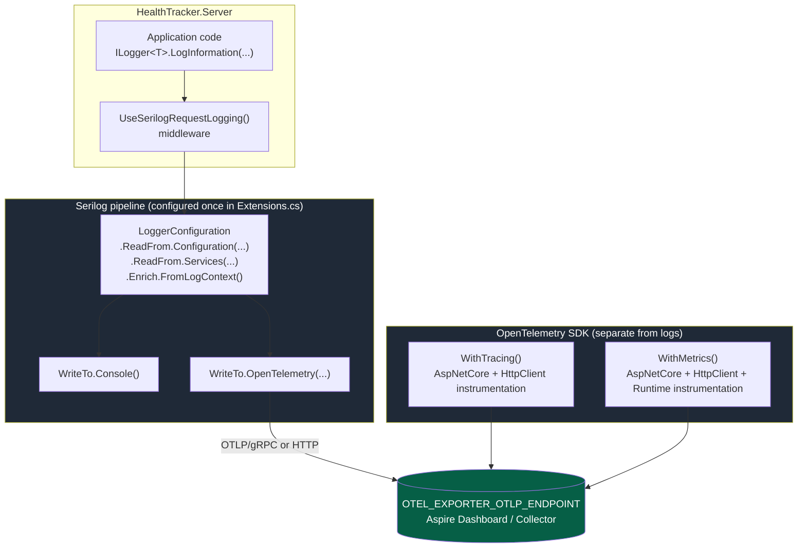
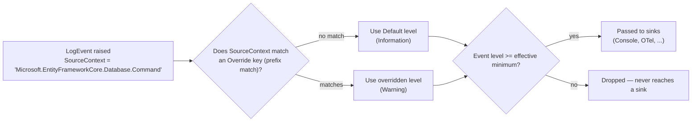
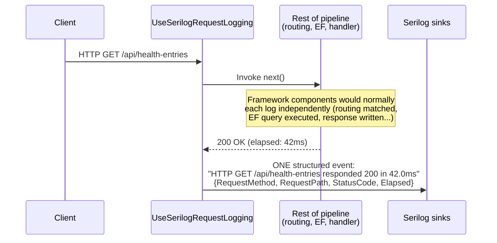

# ASP.NET Core Logging: Serilog + OpenTelemetry (Deep Dive)

> Source project: `health-tracker` (.NET Aspire app), branch `feature/serilog-opentelemetry-logging`.
> This note captures the *why*, not just the *what* — written for interview revision.

---

## 1. The problem this solves

Default `Microsoft.Extensions.Logging` + Aspire's OpenTelemetry logging provider works, but two things bite you
in real services (this happened on a prior project — JCI's Lifecycle Management Portal):

1. **Log noise** — ASP.NET Core, EF Core, and `HttpClientFactory` all log at `Information` by default.
   A single request can emit a dozen framework lines before your own log statement even runs.
2. **Fragmented configuration** — sinks, enrichment, and export targets end up scattered across
   `Program.cs`, `appsettings.json`, and provider-specific extension calls instead of one place.

Serilog fixes both: one `LoggerConfiguration` object owns minimum levels, per-namespace overrides,
enrichment, and every output destination (sink) — console, file, OpenTelemetry, Seq, whatever.

---

## 2. Built-in logging vs Serilog — what actually changes

| | `Microsoft.Extensions.Logging` (default) | Serilog |
|---|---|---|
| Config source | `ILoggingBuilder` + `appsettings.json` `Logging` section | `LoggerConfiguration` + `appsettings.json` `Serilog` section |
| Structure | Message templates, semi-structured | First-class structured events (`LogEvent` with properties) |
| Sinks | "Providers" (Console, EventSource, Debug, OTel) | "Sinks" — much larger ecosystem (Console, File, Seq, OTel, Elasticsearch, ...) |
| Per-namespace levels | `LogLevel` section per category | `MinimumLevel.Override` per source context |
| Enrichment | Manual, via scopes | Declarative: `Enrich.FromLogContext()`, `Enrich.WithMachineName()`, etc. |
| Request logging | One log line per middleware/framework component | `UseSerilogRequestLogging()` collapses a whole request into **one** structured event |

**Key idea:** Serilog doesn't replace `ILogger<T>` in your code — it replaces the *provider* underneath it.
Your controllers/services keep injecting `ILogger<T>` and calling `_logger.LogInformation(...)` exactly as
before. Serilog just becomes the pipe all those calls flow through.

---

## 3. Architecture: where this sits in the app



**The subtlety worth remembering for interviews:** logs, traces, and metrics travel to the *same* OTLP
endpoint but through **two independent code paths**:

- Logs go through **Serilog's own OTel sink** (`Serilog.Sinks.OpenTelemetry`), configured via `WriteTo.OpenTelemetry(...)`.
- Traces/metrics go through the **OpenTelemetry .NET SDK** (`AddOpenTelemetry().WithTracing()/.WithMetrics()`),
  configured via `UseOtlpExporter()`.

They share a destination and a `service.name` resource attribute, but Serilog is *not* wired into the
OpenTelemetry SDK's logging provider — this app deliberately doesn't use
`OpenTelemetry.Extensions.Hosting`'s `.WithLogging()`, because that would mean two competing places to
configure log behavior.

---

## 4. The actual wiring (`Extensions.cs`)

```csharp
public static TBuilder ConfigureOpenTelemetry<TBuilder>(this TBuilder builder)
    where TBuilder : IHostApplicationBuilder
{
    builder.Services.AddSerilog((services, loggerConfiguration) =>
    {
        loggerConfiguration
            .ReadFrom.Configuration(builder.Configuration)   // Serilog section of appsettings.json
            .ReadFrom.Services(services)                     // lets sinks pull DI services if needed
            .Enrich.FromLogContext()                         // picks up LogContext.PushProperty(...)
            .WriteTo.Console();

        var otlpEndpoint = builder.Configuration["OTEL_EXPORTER_OTLP_ENDPOINT"];
        if (!string.IsNullOrWhiteSpace(otlpEndpoint))
        {
            loggerConfiguration.WriteTo.OpenTelemetry(otel =>
            {
                otel.Endpoint = otlpEndpoint;
                otel.ResourceAttributes = new Dictionary<string, object>
                {
                    ["service.name"] = builder.Environment.ApplicationName
                };
            });
        }
    });

    // ...WithMetrics / WithTracing / UseOtlpExporter follow, unrelated to Serilog
}
```

Talking points:

- `ReadFrom.Configuration` is what lets `appsettings.json`'s `"Serilog"` node drive `MinimumLevel` and
  overrides *without* recompiling — same pattern as `IOptions<T>`.
- The OTLP endpoint is read conditionally: **no endpoint configured → no OTel sink registered**, so
  local `dotnet run` without Aspire's dashboard doesn't fail trying to reach a collector that isn't there.
- `Enrich.FromLogContext()` is what makes ambient properties (e.g. a correlation ID pushed with
  `LogContext.PushProperty("CorrelationId", id)`) show up on every log line inside that scope, without
  passing it explicitly to every call.

---

## 5. Killing the noise: `MinimumLevel.Override`

```json
// appsettings.json
{
  "Serilog": {
    "MinimumLevel": {
      "Default": "Information",
      "Override": {
        "Microsoft.AspNetCore": "Warning",
        "Microsoft.EntityFrameworkCore.Database.Command": "Warning",
        "Microsoft.Extensions.Http.DefaultHttpClientFactory": "Warning"
      }
    }
  }
}
```



Why these three specifically:

| Namespace override | What it silences |
|---|---|
| `Microsoft.AspNetCore` | Routing, model binding, middleware pipeline chatter — one line per request per middleware |
| `Microsoft.EntityFrameworkCore.Database.Command` | The full SQL text of **every** query executed, at `Information` |
| `Microsoft.Extensions.Http.DefaultHttpClientFactory` | A start/stop pair of logs for every outgoing `HttpClient` call, including ones wrapped in Polly resilience retries |

**Rule of thumb for interviews:** override *by namespace prefix*, not by disabling a whole provider —
you still want `Warning`/`Error` from these subsystems (e.g. a failed DB command), you just don't want
their routine `Information` chatter.

---

## 6. Collapsing per-request noise: `UseSerilogRequestLogging()`



Without it, a single request can produce 5-10 separate `Information` log lines from different framework
layers. With it, you get **one** structured completion event per request, carrying method, path, status
code, and elapsed time as properties — and you can still see individual `_logger.LogX(...)` calls from
*your* code in between, they're just no longer drowned out by framework internals.

Wired in `Program.cs`, early in the pipeline:

```csharp
app.UseSerilogRequestLogging();
app.UseExceptionHandler();
```

Order matters: it needs to sit close to the top so it can time the *entire* downstream pipeline,
including exception handling.

---

## 7. Traces vs logs: why health checks are filtered differently

```csharp
tracing.AddAspNetCoreInstrumentation(tracing =>
    tracing.Filter = context =>
        !context.Request.Path.StartsWithSegments(HealthEndpointPath)
        && !context.Request.Path.StartsWithSegments(AlivenessEndpointPath)
)
```

- **Traces**: `/health` and `/alive` are explicitly excluded — a load balancer or orchestrator hitting
  these every few seconds would otherwise flood your trace backend with meaningless spans.
- **Logs**: no equivalent filter exists (`UseSerilogRequestLogging` logs every request, health checks
  included) — those endpoints are also only mapped in `app.Environment.IsDevelopment()` in this app
  (see `Extensions.cs`), so this is currently a non-issue locally, but it's a gap worth knowing about
  before enabling health endpoints outside Development.

This is a good interview trap question: *"logging" and "tracing" are configured completely independently
in the OTel/Serilog world* — filtering one does not filter the other.

---

## 8. Centralized package versions

```xml
<!-- Directory.Build.targets -->
<PackageReference Update="Serilog.AspNetCore" Version="10.0.0" />
<PackageReference Update="Serilog.Sinks.OpenTelemetry" Version="4.2.0" />
<PackageReference Update="OpenTelemetry.Exporter.OpenTelemetryProtocol" Version="1.17.0" />
<PackageReference Update="OpenTelemetry.Extensions.Hosting" Version="1.17.0" />
<PackageReference Update="OpenTelemetry.Instrumentation.AspNetCore" Version="1.17.0" />
<PackageReference Update="OpenTelemetry.Instrumentation.Http" Version="1.17.0" />
<PackageReference Update="OpenTelemetry.Instrumentation.Runtime" Version="1.17.0" />
```

`Serilog.AspNetCore` pulls in `Serilog.AspNetCore`, `Serilog.Extensions.Hosting`, and
`UseSerilogRequestLogging`. `Serilog.Sinks.OpenTelemetry` is the piece that lets `WriteTo.OpenTelemetry(...)`
exist at all — without it, that call wouldn't compile.

---

## 9. Interview-style Q&A (self-test)

<details>
<summary>Q: Does adding Serilog change how you write log statements in a controller/service?</summary>

No. You still inject `ILogger<T>` and call `LogInformation`/`LogWarning`/etc. Serilog replaces the
*logging provider* wired up in `Program.cs`/`Extensions.cs`, not the `ILogger` abstraction your code
depends on. This is why the migration in this repo touched `Extensions.cs` and config files, not
any controller.
</details>

<details>
<summary>Q: Why configure the OTel sink conditionally on OTEL_EXPORTER_OTLP_ENDPOINT being set?</summary>

So the app degrades gracefully without an OTel collector present (e.g. plain `dotnet run` outside
Aspire's AppHost). If the sink were unconditional, Serilog would still try to flush to a non-existent
endpoint — swallowed by Serilog's internal error handling, but wasted work and confusing "why are there
no OTel logs" debugging later.
</details>

<details>
<summary>Q: What's the difference between MinimumLevel.Default and MinimumLevel.Override?</summary>

`Default` is the floor for any `SourceContext` that doesn't match an override — effectively your
application's own code. `Override` entries are keyed by namespace prefix and win for any logger whose
category starts with that prefix, regardless of the `Default` value. Overrides can only be paired with
higher levels to reduce framework noise, or lower to get more detail from a specific subsystem while
debugging.
</details>

<details>
<summary>Q: Why is UseSerilogRequestLogging placed before UseExceptionHandler?</summary>

It needs to wrap the entire downstream pipeline to measure total elapsed time and capture the final
status code — including one set by the exception handler on failure. If it were placed after, it would
only time whatever came after `UseExceptionHandler` and could miss the real completion status.
</details>

<details>
<summary>Q: Are logs, metrics, and traces exported through the same code path in this app?</summary>

No — same destination (`OTEL_EXPORTER_OTLP_ENDPOINT`), same `service.name`, but two independent
pipelines: Serilog's own `WriteTo.OpenTelemetry` sink for logs, and the OpenTelemetry .NET SDK's
`WithTracing()`/`WithMetrics()` + `UseOtlpExporter()` for traces/metrics. They are not the same
subsystem and are configured/filtered separately (see §7).
</details>

---

## 10. Takeaways to carry into other projects (e.g. JCI)

1. Put **all** namespace-level noise control in Serilog's `MinimumLevel.Override`, driven from config —
   don't scatter `if (logger.IsEnabled(...))` guards through the codebase.
2. Adopt `UseSerilogRequestLogging()` immediately in any ASP.NET Core service — it's close to a free win
   for log volume with zero loss of information (still one line per request, richer than before).
3. Treat "logs" and "traces" as separate pipelines even when they share a backend/collector — a filter
   on one does not imply the other is filtered too.
4. Keep the OTel sink's activation conditional on the exporter endpoint being configured, so local dev
   without a collector doesn't need special-casing elsewhere.
